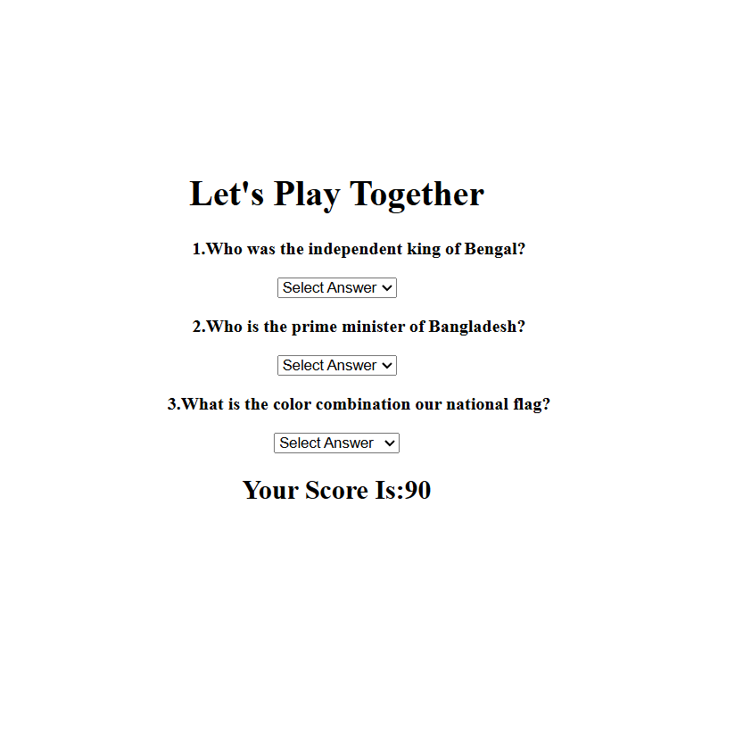

# 📝 Quiz Page Using HTML

> A clean, responsive, and user-friendly quiz page built using only HTML5.

---

## 📸 Project Preview

<p align="center">
  
</p>

---

## 🚀 Live Demo

🔗 **Live Website:**  
https://joni250.github.io/quiz-page-html/

---

## 📂 Repository

🔗 **GitHub Repository:**  
https://github.com/Joni250/quiz-page-html

---

## 📁 Project Structure

```text
quiz-page-html/
│── index.html
│── preview.png
│── README.md
```

## ✨ Features

- ✅ Clean and responsive layout
- ✅ Semantic HTML5 structure
- ✅ Multiple-choice quiz questions
- ✅ Radio button options
- ✅ Well-organized question sections
- ✅ Submit button
- ✅ Beginner-friendly project

---

## 🛠️ Technologies Used

| Technology | Purpose |
|------------|---------|
| HTML5 | Page structure and quiz form |

---


---

## 🎯 Project Purpose

This project was created to practice HTML form elements and semantic page structure by designing a simple quiz page. It focuses on organizing questions clearly while maintaining a clean and responsive layout.

---

## 💡 What I Learned

- Semantic HTML5
- HTML Forms
- Radio Buttons
- Labels and Input Elements
- Form Structure
- Clean Code Organization

---

## 👩‍💻 Author

** Mst Joni Khatun**

Aspiring Frontend & WordPress Developer

GitHub:  
https://github.com/Joni250

---

## ⭐ Support

If you found this project helpful, please consider giving it a ⭐ on GitHub.
